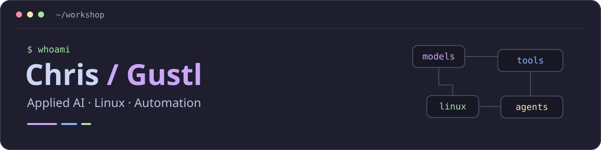

  

  <strong>Ich baue mit AI, Linux und Automatisierung Werkzeuge, die mir im Alltag Arbeit abnehmen.</strong>

  <a href="https://github.com/ChristianGruend?tab=repositories">Projekte</a> ·
  <a href="https://huggingface.co/Gustlson">Hugging Face</a> ·
  <a href="#woran-ich-arbeite">Aktueller Fokus</a>

  
  
  
  
  
  

## Moin, ich bin Chris 👋

Auch als **Gustl** unterwegs. Mein Hintergrund liegt in Cloud und DevOps; heute beschäftige ich mich vor allem mit **angewandter AI**: lokale Modelle auf AMD-GPUs, Agents, Voice AI und die Dienste, die das Ganze verbinden.

Ich lerne durch Bauen und Debuggen. Vieles hier entsteht aus einem konkreten Problem im eigenen Setup: wiederkehrende Handgriffe automatisieren, Kontext zwischen AI-Tools mitnehmen oder Systemdaten auf einem alten USB-Bilderrahmen sichtbar machen.

Mein Ziel: **praktische AI und Automatisierung für kleine Unternehmen, Handwerk und NGOs** zugänglich machen. Eine entsprechende Beratung baue ich auf.

## Aus meiner Werkstatt

| Projekt | Ausgangspunkt & Umsetzung |
| :--- | :--- |
| **[AI Knowledge Ecosystem](https://github.com/ChristianGruend/ai-knowledge-ecosystem)** | Nicht jeder AI dieselbe Geschichte neu erzählen: Markdown-Memory und eine Python-Pipeline, die Chat-Exports in Wissensbausteine und System-Prompts umwandelt. Öffentliche Vorlage mit Platzhaltern für die persönlichen Inhalte. |
| **[AX206 Neon Dashboard](https://github.com/ChristianGruend/ax206-neon-dashboard)** | Ein USB-Bilderrahmen wird zum Systemmonitor: CPU, GPU, RAM und Dienste auf einem kleinen Display. Python sammelt die Metriken und erzeugt das Layout für lcd4linux. |
| **[AMD ROCm KI-Umgebung](https://github.com/ChristianGruend/amd-rocm-ki-umgebung)** | Mit vorhandener AMD-Hardware lokale AI ausprobieren: Docker-Compose-Setup mit Ollama, PyTorch und Jupyter Lab für ROCm. |
| **[Odysseus · mein Fork](https://github.com/ChristianGruend/odysseus)** | Mein selbst gehosteter AI-Workspace auf Basis des [Upstream-Projekts](https://github.com/pewdiepie-archdaemon/odysseus). Ich ergänze mein Setup um Sprachdienste, Bildgenerierung und MCP-Anbindungen. |

## Woran ich arbeite

- **AI im eigenen Setup:** Lokale Modelle und externe Modell-APIs in einem selbst gehosteten Workspace zusammenbringen.
- **Tools verbinden:** Agents über MCP und APIs mit nutzbaren Funktionen versorgen; Sprache und Automatisierung in den Alltag einbauen.
- **Kontext behalten:** Wissen und Arbeitskontext zwischen AI-Tools und Rechnern wiederverwenden.
- **Security vertiefen:** DevSecOps, SOC/SIEM und Zero Trust als Lernfelder mit meinen praktischen Projekten verbinden.

## Werkzeuge & Hintergrund

| Bereich | Womit ich arbeite |
| :--- | :--- |
| **AI & Modelle** | Ollama · Hugging Face · AMD ROCm · MCP · Speech-to-Text / Text-to-Speech |
| **AI beim Entwickeln** | Claude Code · Codex · Kimi Code |
| **Code & Automation** | Python · Bash · REST APIs · Git/GitHub · systemd · Cron |
| **Systeme & Betrieb** | Linux · Docker Compose · Zorin OS · Arch / Hyprland · Manjaro |
| **Cloud-/DevOps-Hintergrund** | AWS · Terraform · Kubernetes · CI/CD |

Linux auf dem Desktop, Catppuccin Mocha in den Configs — und meist ein Projekt, an dem es noch etwas zu verstehen gibt.

## Austausch

Du arbeitest an lokaler AI, einem Linux-Setup oder einer Automatisierung für den Alltag? Für Fragen und Ideen zu meinen Projekten sind die jeweiligen Repository-Issues ein guter Einstieg.

**[GitHub · ChristianGruend](https://github.com/ChristianGruend)** · **[Hugging Face · Gustlson](https://huggingface.co/Gustlson)**

---

**Wissen ist Macht.** Ich möchte Technik verstehen, Wissen teilen und mehr Menschen ermöglichen, ihre eigenen Werkzeuge zu bauen.
